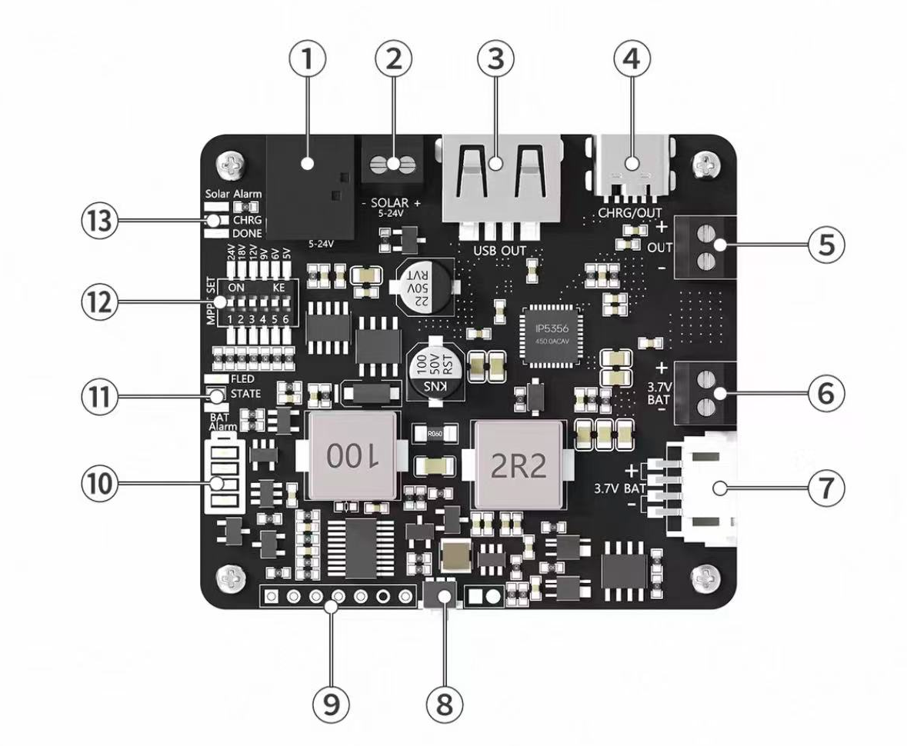
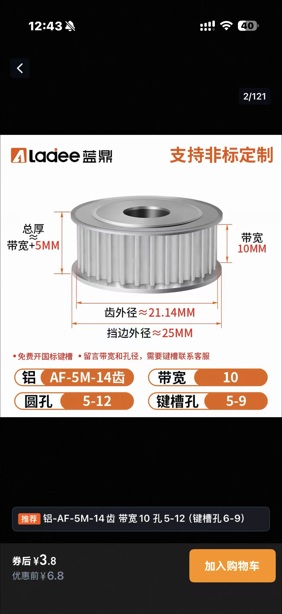
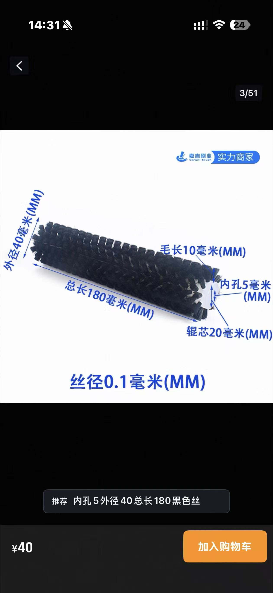
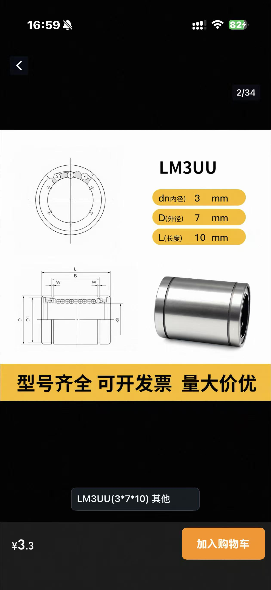
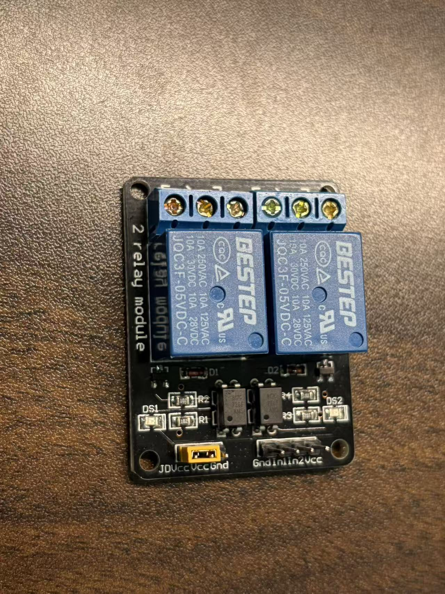
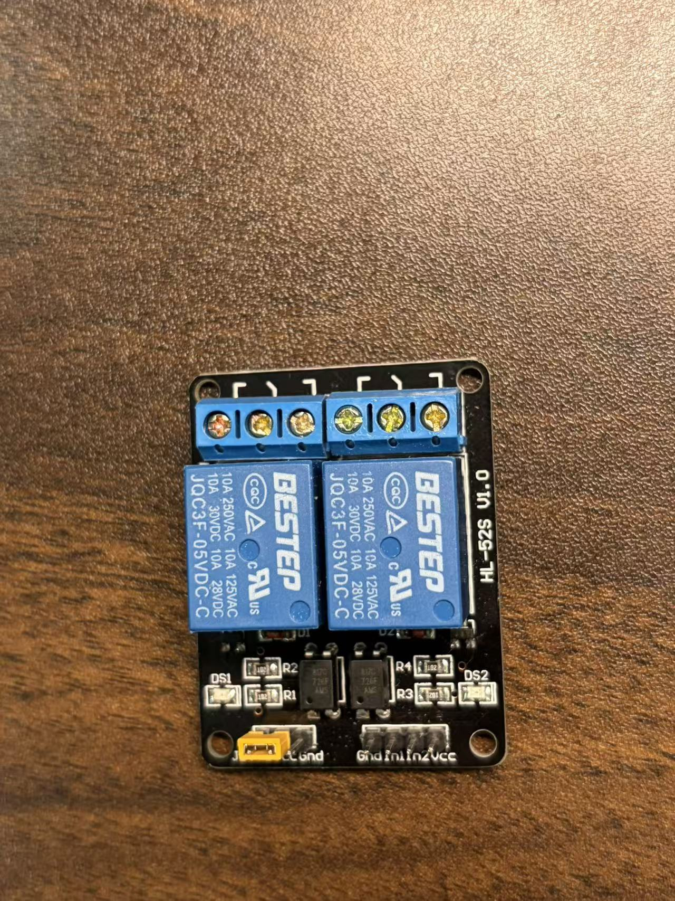
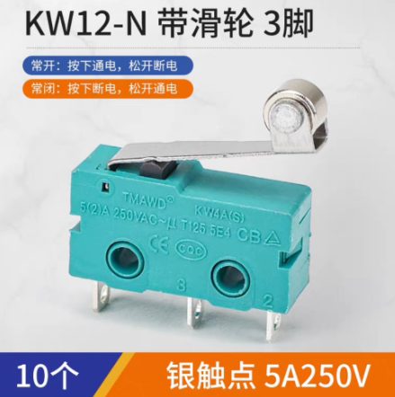
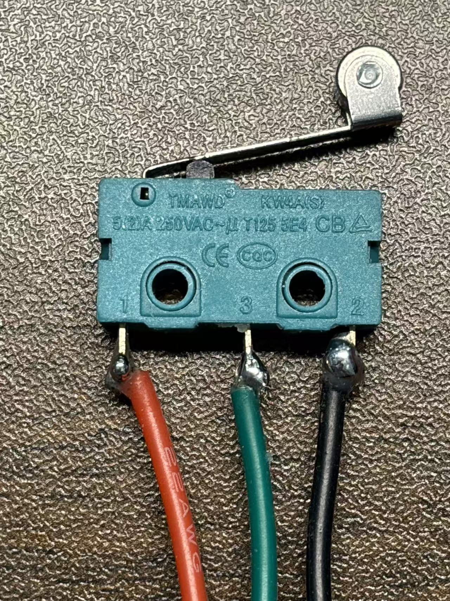
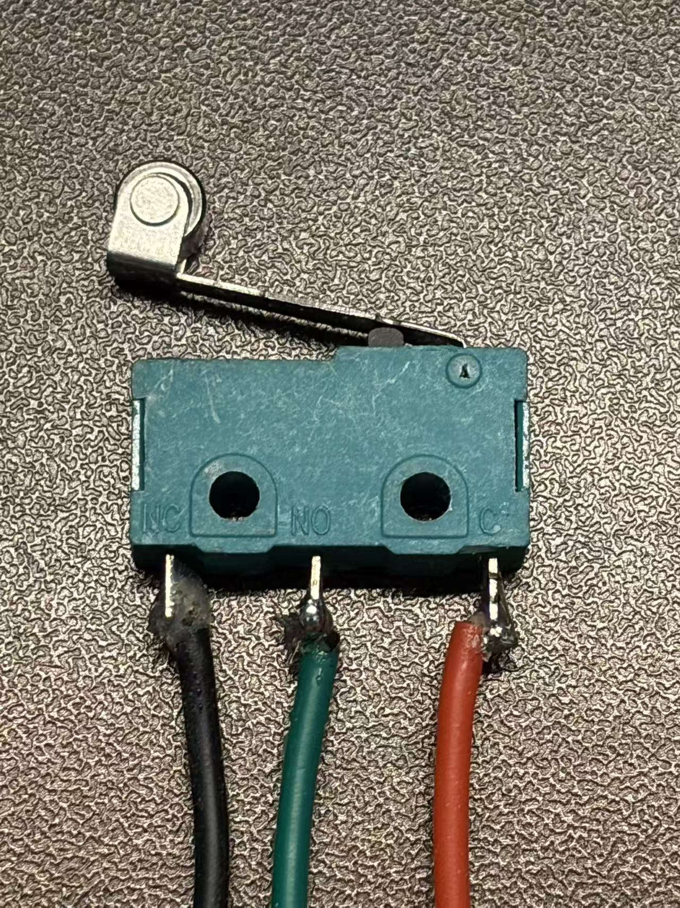

## MPPT
【淘宝】假一赔四 https://e.tb.cn/h.RZhdvN2EaSRWajL?tk=7APp5qFyOdl MF278 「MPPT太阳能充电模块 5V/3.1A Type-C协议快充 18650锂电池管理板」
点击链接直接打开 或者 淘宝搜索直接打开

[详细说明书](https://seengreat.com/wiki/161/)

## 舵机引脚图

## 齿轮规格

## 滚刷规格

## 直线轴承规格

## 继电器

## 行程开关

## 直流电机

6V50转速
6V190转速（滚刷用的是这个）

[2分钟组装【双轴滑块】N20减速电机版本](https://www.bilibili.com/video/BV1mnebzcErX/?spm_id_from=333.1387.search.video_card.click&vd_source=5bfa535549338540040a384eca47fc3a)
[【三轴滑块】Y轴升级双驱动同步轮 舵机+N20减速电机](https://www.bilibili.com/video/BV1saa8zREeU/?spm_id_from=333.1387.search.video_card.click&vd_source=5bfa535549338540040a384eca47fc3a)

