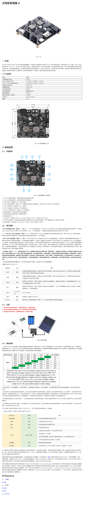
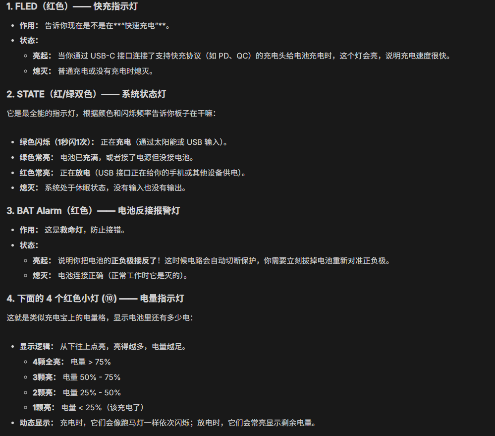

[说明书](https://seengreat.com/wiki/161/)

[2分钟组装【双轴滑块】N20减速电机版本](https://www.bilibili.com/video/BV1mnebzcErX/?spm_id_from=333.1387.search.video_card.click&vd_source=5bfa535549338540040a384eca47fc3a)
[【三轴滑块】Y轴升级双驱动同步轮 舵机+N20减速电机](https://www.bilibili.com/video/BV1saa8zREeU/?spm_id_from=333.1387.search.video_card.click&vd_source=5bfa535549338540040a384eca47fc3a)

